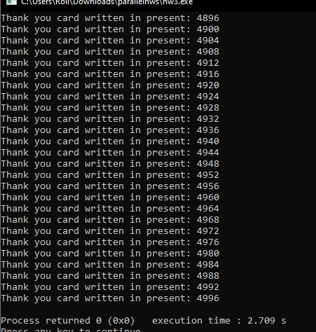

# parallelhw3

# Compiling and running

1-Go to the directory with problem1.cpp or problem2.cpp

2-Run the following command:

__g++ -std=c++11 problem1.cpp -o problem1 -lpthread__  
(for problem 1) 
__g++ -std=c++11 problem2.cpp -o problem2 -lpthread__  
(for problem 2) 

3-Run the following command:

__./problem1__ 
(for problem 1) 
__./problem2__ 
(for problem 2) 

4-Check console for results

# Problem 1
Problem one was about making a linked list and making the threads work on different things at the same time. 
We used num_servants to indicate the # of threads what were going to work on the presents. 

I tried to make it without any mutex but I would always find them going for the same threads. 
It then checks the tag to see if it needs to have the thank you written on it or not. 

# Problem 2
After reading about it, Problem 2 could be solved without any uses of mutex 
This is because every sensor could only work on a certain segment of an array and fill it with values 
The main() thread could be the 'reader' thread that reads every input and calculates it. 
It would do this once it sees that all the array indexes have been filled with a temperature. 
With this, we would only be limited by the reading every minute since adding more threads honestly does not matter at all for efficiency because we are still waiting on the timer. 
Although this was my intended and simplest approach, I ended up doing something else due to confusion and rush.  